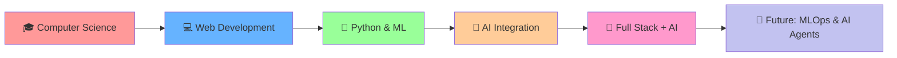

# <div align="center">👋 Hi there! I'm **Nadeem Ahmad**</div>

<div align="center">
  
[](https://git.io/typing-svg)

</div>

<div align="center">
  
🎯 **Building the future with AI-powered web applications** | 🌟 **Transforming complex data into intelligent solutions**

📍 **Faisalabad, Pakistan** | 🎓 **Software Engineering @ FAST NUCES** | 💼 **Open for opportunities**

</div>

---
## 🚀 About Me  
<div align="center">

| 💼 **Role** | 🧑‍💻 Machine Learning Engineer & Full Stack Developer |
|-------------|-------------------------------------------------------|
| 🎯 **Current Focus** | Next.js 14 • AI Integration • MERN Stack • Deep Learning |
| ⚡ **Working On** | AI-powered web apps with intelligent automation |
| 📚 **Learning** | Advanced MLOps • LangChain • AI Agent Development |
| 💡 **Ask Me About** | React • Next.js • Python ML • AI Integration • System Architecture |
| 🎲 **Fun Fact** | Achieved **99.57% accuracy** in a custom Computer Vision model |
| 🏹 **Motto** | *“Code with purpose, build with intelligence!”* |

</div>


---

## 🛠️ **Tech Arsenal**

<div align="center">

### **🎨 Frontend Magic**
<p>
  
</p>

### **⚙️ Backend Power**
<p>
  
</p>

### **🗄️ Database Masters**
<p>
  
</p>

### **🤖 AI & ML Stack**
<p>
   
  
  
  
  
  

</p>

### **☁️ Cloud & DevOps**
<p>
  
</p>

### **🔧 Tools & More**
<p>
  
  
  
  
</p>

</div>

---

## 📊 **GitHub Analytics Dashboard**

<div align="center">


</div>

<div align="center">


</div>

<div align="center">


</div>

---
## 💪 **Skills Mastery**

<div align="center">

### 🔥 **Expertise Levels**

<table>
<tr>
<td width="50%">

#### **🎨 Frontend Wizardry**
```text
Next.js           ████████████████████░   95%
React.js          ████████████████████░   90%
TypeScript        ███████████████████░░   85%
JavaScript        ████████████████████░   92%
HTML5/CSS3        ████████████████████░   88%
Tailwind CSS      ███████████████████░░   87%
```

#### **🤖 AI/ML Engineering**
```text
Machine Learning  ████████████████████░   92%
Deep Learning     ███████████████████░░   88%
Computer Vision   ████████████████████░   90%
NLP Processing    ███████████████████░░   85%
Data Science      ████████████████████░   89%
MLOps            ██████████████████░░░   82%
```

</td>
<td width="50%">

#### **⚙️ Backend Mastery**
```text
Node.js           ████████████████████░   90%
Python            ████████████████████░   95%
Express.js        ███████████████████░░   85%
FastAPI           ██████████████████░░░   80%
REST APIs         ████████████████████░   93%
GraphQL           ██████████████████░░░   78%
```

#### **🗄️ Database & Cloud**
```text
MongoDB           ███████████████████░░   85%
PostgreSQL        ██████████████████░░░   80%
Prisma ORM        ███████████████████░░   83%
Docker            ██████████████████░░░   75%
AWS Services      █████████████████░░░░   72%
Git/GitHub        ████████████████████░   95%
```

</td>
</tr>
</table>

---

### 🏆 **Skill Categories**

<div align="center">

| **🚀 Core Competencies** | **🎯 Specializations** | **🌱 Learning Path** |
|:------------------------:|:----------------------:|:--------------------:|
| **Full Stack Development** | **AI Integration** | **Advanced MLOps** |
| `⭐⭐⭐⭐⭐` | `⭐⭐⭐⭐⭐` | `⭐⭐⭐⭐☆` |
| **MERN Stack** | **Computer Vision** | **LangChain** |
| `⭐⭐⭐⭐⭐` | `⭐⭐⭐⭐⭐` | `⭐⭐⭐⭐☆` |
| **Python ML/AI** | **Web Automation** | **AI Agents** |
| `⭐⭐⭐⭐⭐` | `⭐⭐⭐⭐☆` | `⭐⭐⭐☆☆` |

</div>

---

### 🎯 **Technology Proficiency Matrix**

<div align="center">

<details>
<summary><b>🎨 Frontend Technologies</b></summary>
<br>

| Technology | Experience | Projects | Proficiency |
|:---------:|:----------:|:--------:|:-----------:|
| **Next.js 14** | 2+ years | 15+ |  |
| **React.js** | 2+ years | 20+ |  |
| **TypeScript** | 1.5+ years | 12+ |  |
| **Tailwind CSS** | 2+ years | 18+ |  |

</details>

<details>
<summary><b>⚙️ Backend Technologies</b></summary>
<br>

| Technology | Experience | Projects | Proficiency |
|:---------:|:----------:|:--------:|:-----------:|
| **Node.js** | 2+ years | 15+ |  |
| **Python** | 3+ years | 25+ |  |
| **Express.js** | 2+ years | 12+ |  |
| **FastAPI** | 1+ years | 8+ |  |

</details>

<details>
<summary><b>🤖 AI/ML Technologies</b></summary>
<br>

| Technology | Experience | Projects | Proficiency |
|:---------:|:----------:|:--------:|:-----------:|
| **TensorFlow** | 2+ years | 10+ |  |
| **PyTorch** | 1.5+ years | 8+ |  |
| **Scikit-learn** | 2.5+ years | 15+ |  |
| **OpenCV** | 2+ years | 12+ |  |

</details>

<details>
<summary><b>🗄️ Databases & Tools</b></summary>
<br>

| Technology | Experience | Projects | Proficiency |
|:---------:|:----------:|:--------:|:-----------:|
| **MongoDB** | 2+ years | 18+ |  |
| **PostgreSQL** | 1.5+ years | 10+ |  |
| **Docker** | 1+ years | 8+ |  |
| **Git/GitHub** | 3+ years | 50+ |  |

</details>

</div>

---

### 🎖️ **Achievement Badges**

<div align="center">


</div>

---

### 📈 **Learning Journey**

<div align="center">



</div>

</div>

---

## 🌟 **Let's Connect & Collaborate!**

<div align="center">

[](https://www.linkedin.com/in/nadeem-ahmad3/)
[](mailto:nadeemahmad2703@gmail.com)
[](https://wa.me/923117133585)
[](#)

</div>

---

<div align="center">

### 💫 **"Where AI meets Web Development - Creating intelligent solutions that matter!"**


</div>

<div align="center">

**⭐ Star my repositories if you find them useful! | 🤝 Always open to interesting collaborations**

</div>
